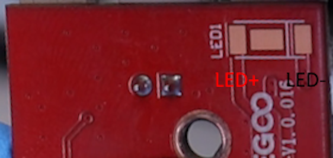
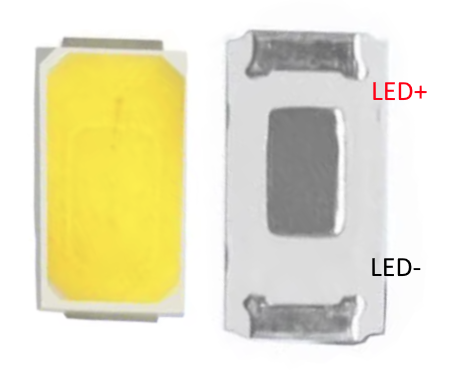
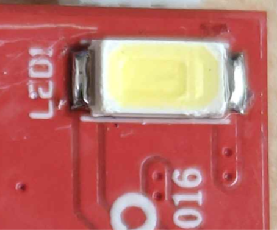
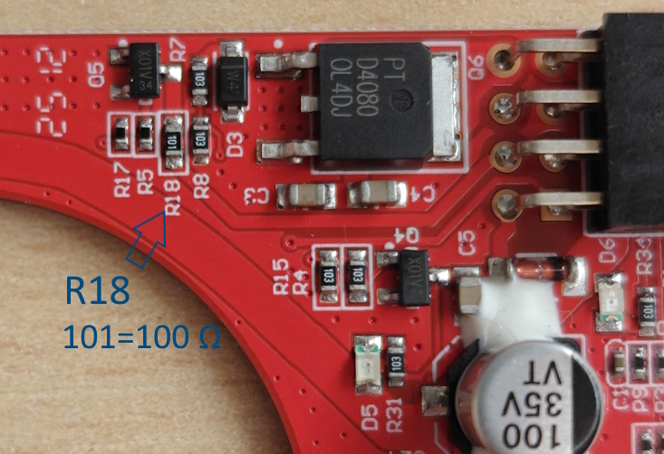
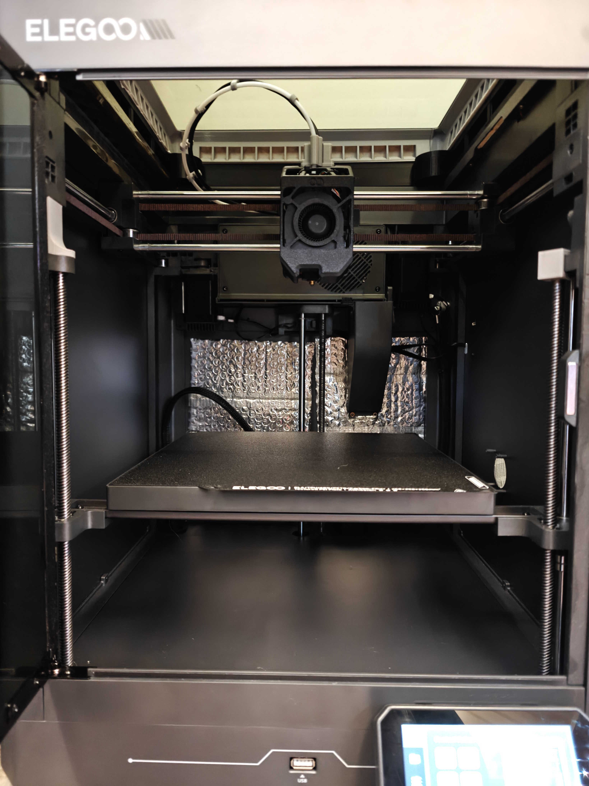
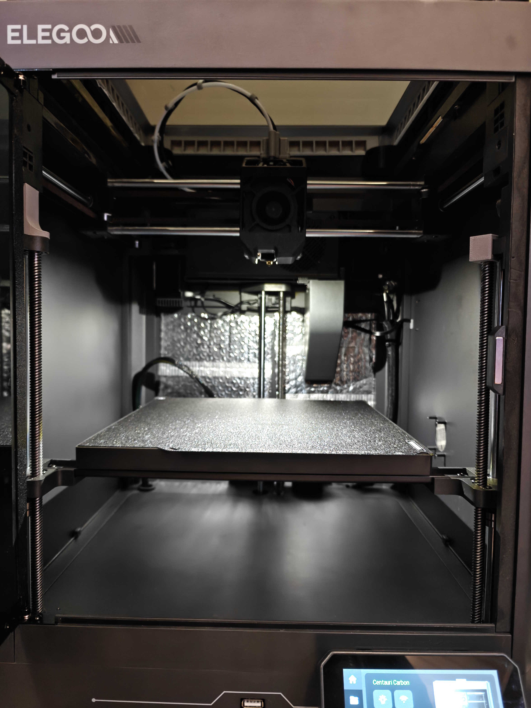
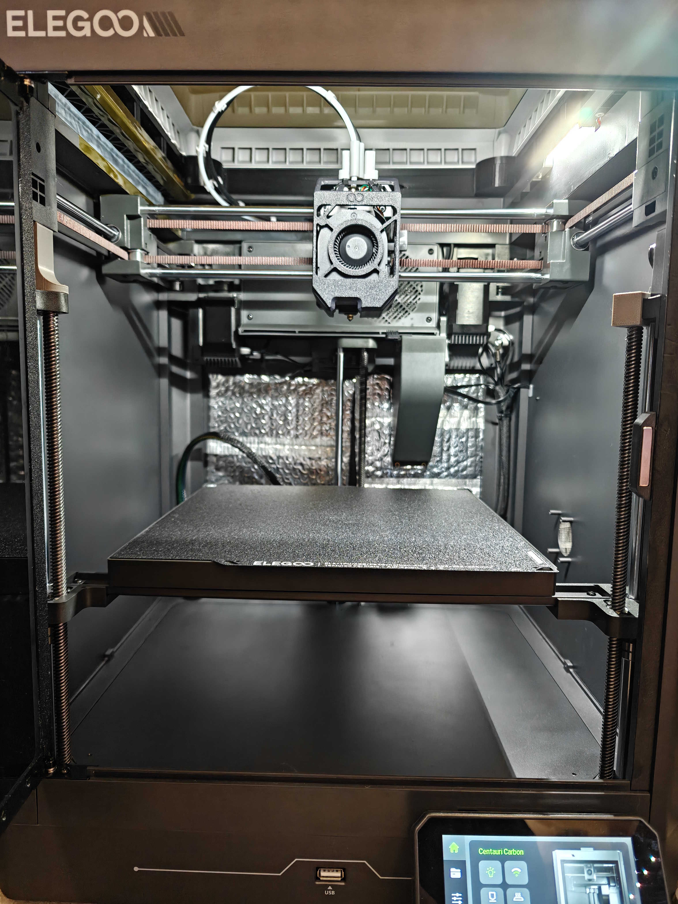
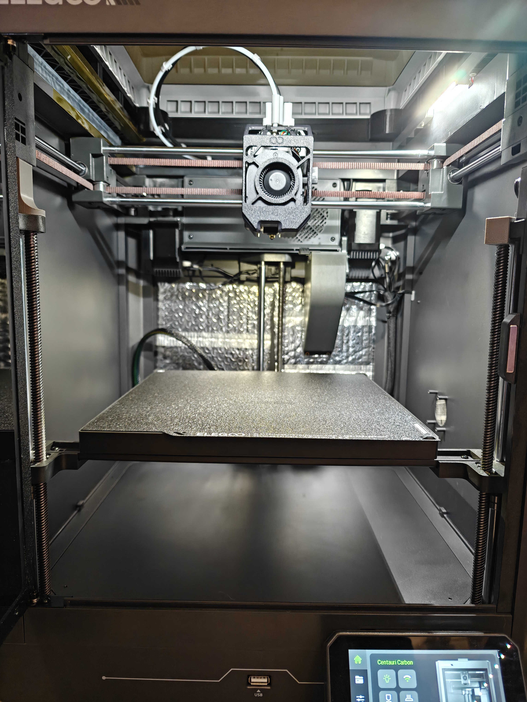
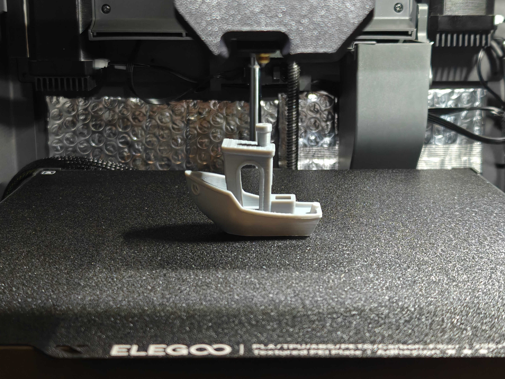
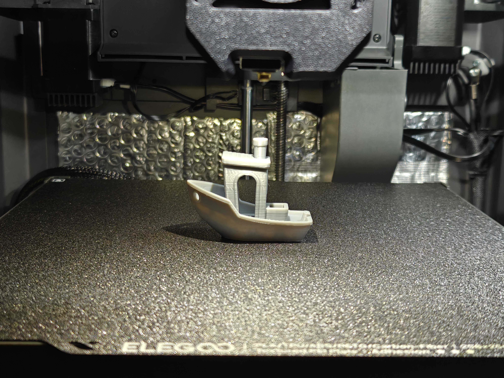

# Toolhead Nozzle LED Installation and Configuration  

This section describes how and where to solder and use the missing nozzle LED on the Centauri Carbon toolhead.  
It also includes instructions on replacing the existing resistor to increase the LED brightness.

The Centauri Carbon includes a MOSFET circuit for a nozzle LED, but the LED itself is unpopulated.  
The installed current-limiting resistor (100 Ω) results in a dim output, drawing only about 20 mA. With a few quick soldering steps, you can enable and tune this feature.

If you need any support, feel free to [join the Discord](https://discord.gg/t6Cft3wNJ3)  


## Requirements  

### Required  
- **Soldering iron**  
  Used to solder the LED and (optionally) replace the resistor.
- **LED:** [WHITE 5730 LED (Cold White)](https://aliexpress.com/item/1005005760920669.html)   
  Choose the **WHITE 5730** variant — it should match the cold white tone of the chamber LED.

### Optional  
- **Hot air gun**  
  Helpful when soldering the 5730 LED, as it has three pads.  
  The center pad is used for heat transfer to the PCB, but it’s not required for this mod since the LED runs well below its maximum temperature, even in warm chambers.
- **Resistor:** [27 Ω SMD resistor (0603 size)](https://aliexpress.com/item/1005005677654015.html)  
  Replaces the stock **100 Ω** resistor to make the LED brighter, increases the current from 20mA to 75mA. The forward voltage increases from 2.72V to 2.92V.  
  These values will differ slightly from LED to LED. 


## Overview  

- The toolhead PCB includes a nozzle LED circuit controlled by MCU pin PC9.  
- The **LED + side** connects to the **+5 V rail** (always powered).  
- The **LED – side** is switched through a MOSFET, controlled by the firmware.  
- The **current-limiting resistor (R18)** is already present on the PCB but its value limits brightness heavily.


## Installation  

### 1. Locate the LED pads on the front edge of the toolhead PCB. 
  

### 2. Orientation:  
  Align the LED so the wider gaps match the PCB pattern before soldering.   
  Additionally, the PCB has a **white line** marking on the **negative side** for easy orientation.  
   
### 3. Solder the white 5730 LED onto the existing footprint:  
    
  On the LED, the **negative side** can be identified by the **larger gap** between the center pad and the outer pad.  

  It should look something like this:  
     

### 4. (Optional) Replace resistor R18 with 27 Ω if higher brightness is desired.  
    

### 5. Reassemble the toolhead.  

!!! warning "Note"   
    We recommend against going below 27 Ω, as the LED may overheat in high-temperature chamber conditions.


## Testing  
You can manually test the nozzle LED by running the following G-code files directly from your printer’s touchscreen or web interface:

- [**LED_ON.gcode**](assets/LED_ON.gcode) — turns the nozzle LED **on**  
- [**LED_OFF.gcode**](assets/LED_OFF.gcode) — turns the nozzle LED **off**

If your LED lights up correctly when running `LED_ON.gcode` and turns off with `LED_OFF.gcode`, the installation is successful.


## G-code Usage  

Add the following lines to your slicer’s machine start and end G-code to automatically control the nozzle LED:

### Machine Start G-code
```
SET_LED_led1 RED=1 GREEN=1 BLUE=1 WHITE=1 TRANSMIT=1
```
 

### Machine End G-code  

```
SET_LED_led1 RED=0 GREEN=0 BLUE=0 WHITE=0 TRANSMIT=1
```

This will automatically turn the LED **on** when a print starts and **off** when it finishes.  
We'd recommend putting it at the top of Machine Start G-code and at the bottom of Machine End G-code.  


## Before & After  
 
The pictures below were taken with a 30 Ω resistor installed. Expect noticeably less brightness if you don’t replace R18.  

| Before | After |
|:-------:|:------:|
| <figure markdown="span"><figcaption><em>No LEDs on</em></figcaption></figure> | <figure markdown="span"><figcaption><em>Nozzle LED on</em></figcaption></figure> |
| <figure markdown="span"><figcaption><em>Chamber LEDs on</em></figcaption></figure> | <figure markdown="span"><figcaption><em>Chamber & Nozzle LEDs on</em></figcaption></figure> |
| <figure markdown="span"><figcaption><em>Chamber LEDs on</em></figcaption></figure> | <figure markdown="span"><figcaption><em>Chamber & Nozzle LEDs on</em></figcaption></figure> |


## Credits  
[Synthetic Electron 3D](https://www.youtube.com/@SyntheticElectron3D) on YouTube for finding the unused footprint on the PCB, [his video on this topic](https://www.youtube.com/watch?v=1B1BzOQMkCI&lc=UgzqtT4OAFaG_nfkXIB4AaABAg) can be found on his channel.  
Guide and images by _sjoerd on the OpenCentauri Discord.

