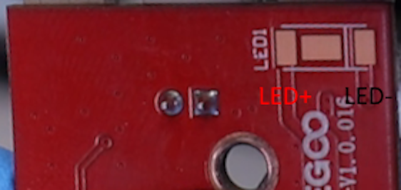
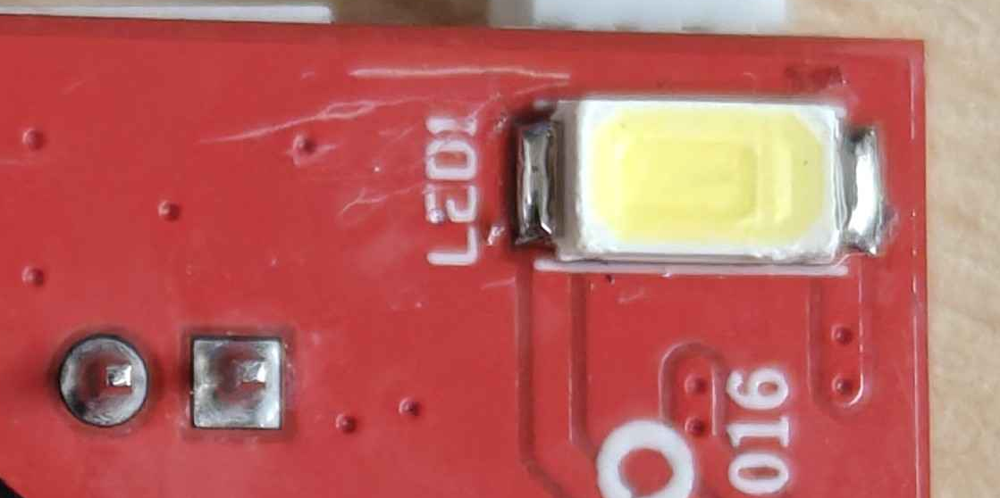

# Toolhead Nozzle LED Installation and Configuration

This section describes how and where to solder and use the **missing nozzle LED** on the Centauri Carbon toolhead.  
It also includes instructions on **replacing the existing resistor** to increase the LED brightness for better visibility during prints.

Most Centauri Carbon printers ship with the MOSFET circuit for the nozzle LED already present, but the LED itself is unpopulated.  
The current-limiting resistor is also populated, though its value (100 Ω) results in a dim LED once installed.  
With a few quick soldering steps, you can enable and tune this feature.

If you need any support, feel free to [join the Discord](https://discord.gg/t6Cft3wNJ3) 💬


## Requirements

### Required
- **Soldering iron**  
  Used to solder the LED and (optionally) replace the resistor.
- **LED:** [WHITE 5730 LED (Cold White)](https://aliexpress.com/item/1005005760920669.html)   
  Choose the **WHITE 5730** variant — it matches the cold white tone of the chamber LED.

### Optional
- **Hot air gun**  
  Helpful when soldering the 5730 LED, as it has three pads.  
  The center pad is used for heat transfer to the PCB, but it’s not required for this mod since the LED runs well below its maximum temperature, even in warm chambers.
- **Resistor:** [27 Ω SMD resistor (0603 size)](https://aliexpress.com/item/1005005677654015.html)  
  Replaces the stock **100 Ω** resistor to make the LED brighter.


## Overview

- The toolhead PCB includes a **nozzle LED circuit** controlled by **MCU pin PC9**.  
- The **LED + side** connects to the **+5 V rail** (always powered).  
- The **LED – side** is switched through a MOSFET, controlled by the firmware.  
- The **current-limiting resistor (R18)** is already present on the PCB but its value limits brightness heavily.


## Installation

1. Locate the **LED pads** on the front edge of the toolhead PCB. 
 
2. **Orientation:**  
   Align the LED so the wider gaps match the PCB pattern before soldering.   
   Additionally, the PCB has a **white line** marking on the **negative side** for easy orientation.  
   
3. Solder the **white 5730 LED** onto the existing footprint:  
     
    On the LED, the **negative side** can be identified by the **larger gap** between the center pad and the outer pad.  

    It should look something like this  
    
4. (Optional) Replace **resistor R18** with **27 Ω** if higher brightness is desired.  
    
5. Reassemble the toolhead.

> ⚠️ **Note:**  
> We recommend against going for a lower resistance than 27 Ω, as the LED may run too hot when the chamber gets hot.


## Klipper Configuration

The Centauri Carbon's printer.cfg already includes this LED definition:

```ini
[led led1]
red_pin: stm32:PC9
cycle_time: 0.016
```

No additional configuration is required.


## Testing
You can manually test the nozzle LED by running the following G-code files directly from your printer’s touchscreen or web interface:

- [**LED_ON.gcode**](LED_ON.gcode) — turns the nozzle LED **on**  
- [**LED_OFF.gcode**](LED_OFF.gcode) — turns the nozzle LED **off**

If your LED lights up correctly when running `LED_ON.gcode` and turns off with `LED_OFF.gcode`, the installation is successful.


## G-code Usage

Add the following lines to your slicer’s machine start and end G-code to automatically control the nozzle LED:


### Machine Start G-code
```gcode
SET_LED_led1 RED=1 GREEN=1 BLUE=1 WHITE=1 TRANSMIT=1
```


### Machine End G-code
```gcode
SET_LED_led1 RED=0 GREEN=0 BLUE=0 WHITE=0 TRANSMIT=1
```

This will automatically turn the LED **on** when a print starts and **off** when it finishes.  
We'd recommend putting it at the top of Machine Start G-code and at the bottom of Machine End G-code


## Summary

| Item | Description |
|------|--------------|
| **Control Pin** | PC9 |
| **Default Resistor** | 100 Ω |
| **Recommended Replacement** | 27 Ω |
| **LED Type** | Cold White 5730 SMD |


After completing this modification, your Centauri Carbon gains a **fully functional and bright nozzle LED**, making it easier to monitor prints and improving toolhead illumination.
